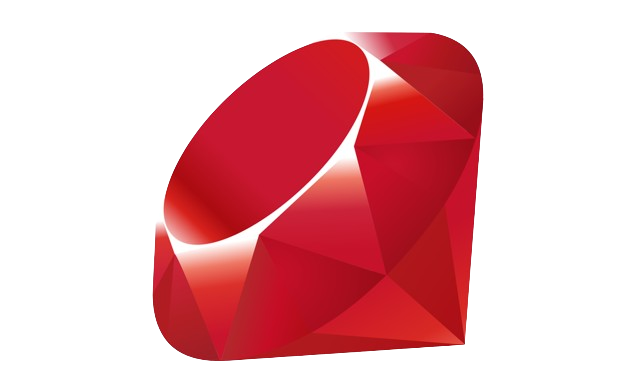

<div align="center" id="top"> 
  

</div>

<h1 align="center">Ruby</h1>

<p align="center">
    

</p>


<h4 align="center"> 
	🚧  Status: Under construction... 🚀  🚧
</h4> 

<hr>

<p align="center">
  <a href="#dart-about">About</a> &#xa0; | &#xa0; 
  <a href="#rocket-technologies">Technologies</a> &#xa0; | &#xa0;
  <a href="#white_check_mark-requirements">Requirements</a> &#xa0; | &#xa0;
  <a href="#checkered_flag-starting">Starting</a> &#xa0; | &#xa0;
  <a href="#bulb-projects">Projects</a> &#xa0; | &#xa0;
  <a href="#memo-license">License</a> &#xa0; | &#xa0;
  <a href="#rocket-author" target="_blank">Author</a>
</p>

<br>

## :dart: About ##

This repository is about my journey in learning Ruby. It includes projects, exercises, and code snippets related to my study of the Ruby programming language.

## :rocket: Technologies ##

The following tools were used in this project:

- <a href="https://www.ruby-lang.org/" target="_blank">Ruby</a>
  
## :white_check_mark: Requirements ##

Before starting :checkered_flag:, you need to have Ruby installed on your machine.

## :checkered_flag: Starting ##

```bash
# Clone this project
$ git clone https://github.com/kibongos40/ruby

# Access
$ cd ruby

# Run a file
$ ruby {file_name}.rb
```
## :bulb: Projects ##

### Here are some small  projects in this repo

- **Todo List App**: A simple todo-list application written in Ruby.
  - [Code](todo.rb)

## :memo: License ##

This project is under license from MIT.

## :rocket: Author ##

Made with :heart: by <a href="https://github.com/kibongos40" target="_blank">Kibongo Simon Peter</a>

&#xa0;

<a href="#top">Back to top</a>
